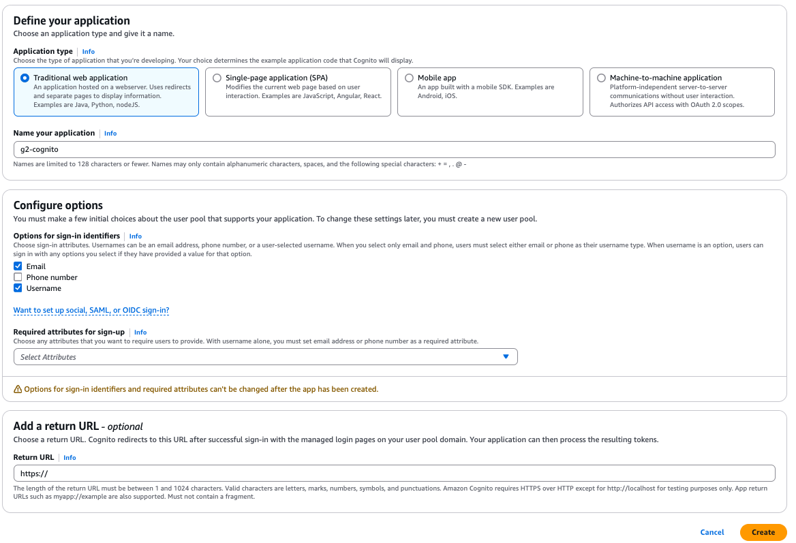

# sb3-aws-cognito-bff
Spring boot 3 application with login AWS Cognito

# AWS Cognito
## Create a user pool
- Go to the AWS Cognito console.
- Click on Create a user pool.
- Define your application: `Traditional web application`
- Set name your application
- Configure options for sign-in: `Email` and `username`
- click on `Create`
<br>

<br>
After creating the user pool, you can see the `App clients` is created automatically. <br>
In the app clients, you can see the `App client id` and `App client secret`. <br>

### Authentication flow
In the `App client information`, click on `Edit` and configure the Authentication flow <br>
 <br>

### Create User
Now create user...<br>


# AWS Cognito SDK

## Configuration

### 1 - Add in build.gradle or pom.xml includes the AWS SDK for Cognito and any necessary Spring Boot dependencies
```
implementation 'org.springframework.boot:spring-boot-starter-web'
implementation 'org.springframework.boot:spring-boot-starter-security'

implementation 'software.amazon.awssdk:cognitoidentityprovider:2.29.52'
```

### 2 - Create class CognitoConfig <br>
See the file [CognitoConfig.java](src/main/java/br/dev/g2/cognnito_sb_demo/config/CognitoConfig.java)

### 3 - Create endpoint to login <br>
See the file [AuthController.java](src/main/java/br/dev/g2/cognnito_sb_demo/controller/AuthController.java), 
[AuthService.java](src/main/java/br/dev/g2/cognnito_sb_demo/service/AuthService.java)

### 4 - Add the AWS credentials and region to your application.properties or application.yml:
```
aws:
  accessKeyId: <accessKeyId>
  secretAccessKey: <secretAccessKey>
  region: <region>
```

### 5 - Who obtain the `accessKeyId` and `SecretAccessKey`.<br>

#### 5.1 - Create a user in AWS Cognito

- Access the console AWS
- Go to the IAM service
- In the side menu, click on Users and then on Add user.
- Fill in the username and select the Programmatic access option.
- Click Next.
- Assign User Permissions
  - You can assign user permissions in two ways:
    - Assign policies directly: <br>
        Select a predefined policy such as `AmazonCognitoPowerUser` or `AdministratorAccess` (if you need broad access for testing). <br>
      or <br>
    - Add the user to a group:<br>
      Create a group and assign a policy to the group, such as AmazonCognitoPowerUser.
- Click Next and finish creating the user.

#### 5.2 - Get the `accessKeyId` and `SecretAccessKey`

After creating the user: <br>
The console will show the `Access Key ID` and `Secret Access Key`. <br>
Save this information immediately, as the Secret Access Key will only be displayed once.<br>
You can download a .csv file containing the keys.

Now, add the `accessKeyId` and `SecretAccessKey` in the application.yml file.

### 6 - Create a `SECRET_HASH` for the user
See the class [CognitoSecretHash.java](src/main/java/br/dev/g2/cognnito_sb_demo/service/CognitoSecretHash.java) <br>
In the class AuthService is called the method `calculateSecretHash` to create the `SECRET_HASH` <br>

**Finally, you can test the login endpoint.**

# Application Resource Server

### 7 - Config the Spring Security to use OAuth2

#### 7.1 Add the dependencies in build.gradle
```
implementation 'org.springframework.boot:spring-boot-starter-oauth2-client'
implementation 'org.springframework.boot:spring-boot-starter-oauth2-resource-server'
```
#### 7.2 add properties in application.yml
```
spring:
  security:
    oauth2:
      resourceserver:
        jwt:
          issuer-uri: <issuer-uri>
```

#### 7.3 See the files to configure the Spring Security and endpoint to test the login with OAuth2
[SecurityConfig.java](src/main/java/br/dev/g2/cognnito_sb_demo/config/SecurityConfig.java) <br>
[UserController.java](src/main/java/br/dev/g2/cognnito_sb_demo/controller/UserController.java) <br>

### 8 - Tests

#### 8.1 - Test the login endpoint
```
curl --location 'localhost:8080/auth/login' \
--header 'Content-Type: application/json' \
--data-raw '{
    "username": "username",
    "password": "password",
    "clientId": "clientId"
}'
```
get the `accessToken` to use in the next test.

#### 8.2 - Test the protected endpoint

```
curl --location 'localhost:8080/v1/user' \
--header 'Authorization: Bearer <accessToken>'
```

**Then you will receive status 200!**